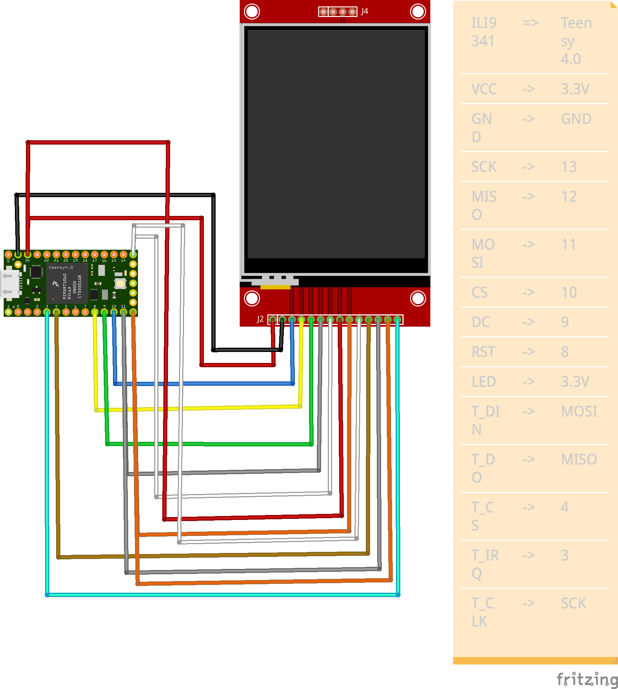

# teensy4-rust-discovery
Embedded Rust with Raspberry Teensy 4

## Getting started
Project was generated using teensy4-rs-template
```bash
cargo generate --git https::/github.com/mciantyre/teensy4-rs-template --name teensy4-rust-discovery
cd teensy4-rust-discovery
cargo objcopy --release -- -O ihex teensy4-rust-discovery.hex
teensy_loader_cli --mcu=TEENSY40 -w -v teensy4-rust-discovery.hex
```

## Getting runner

```bash
git clone https://github.com/mciantyre/teensy4-rs.git
cd teensy4-rs/tools
cargo build --release
cargo install --path .
teensy4-runner
Error: "Supply the path to a Teensy 4 ELF program"
```

After adding this to config.toml:
```toml
runner = "teensy4-runner"
```

You can simply execute:
```bash
cargo run
Compiling teensy4-rust-discovery v0.1.0 (teensy4-rust-discovery)
    Finished `dev` profile [unoptimized + debuginfo] target(s) in 20.27s
     Running `teensy4-runner target/thumbv7em-none-eabihf/debug/teensy4-rust-discovery`
Teensy Loader, Command Line, Version 2.3
Read "target/thumbv7em-none-eabihf/debug/teensy4-rust-discovery.hex": 129428 bytes, 6.4% usage
Waiting for Teensy device...
 (hint: press the reset button)
Found HalfKay Bootloader
Read "target/thumbv7em-none-eabihf/debug/teensy4-rust-discovery.hex": 129428 bytes, 6.4% usage
Programming...............................................................................................................................
Booting
```

## Examples
To run the examples `cargo run --example <example name> --release`.

### ILI9341
ILI9341 | => | Teensy 4.0
----|----|-----
VCC | -> | 3.3V
GND | -> | GND
SCK | -> | 13
MISO | -> | 12
MOSI | -> | 11
CS | -> | 10
DC | -> | 9
RST | -> | 8
LED | -> | 3.3V
T_DIN | -> | MOSI
T_DO| -> | MISO
T_CS | -> | 4
T_IRQ| -> | 3
T_CLK| -> | SCK



### SSD1306
SSD1306 | => | Teensy 4.0
----|----|-----
VCC | -> | 3.3V
GND | -> | GND
SDA | -> | 18
SCL | -> | 19